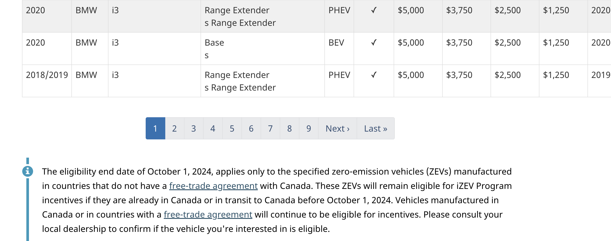
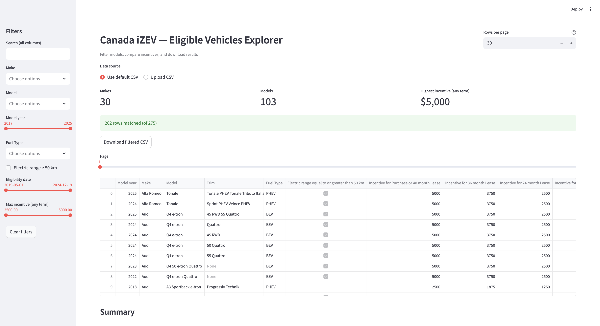

Perfect — this looks really close to a polished final README 🎉
You’ve done 95% of the work! Let’s just make a few small improvements so it renders cleanly and looks great on GitHub.

Here’s your final cleaned-up version (copy-paste it straight into your README.md):

⸻


# 🇨🇦 iZEV Eligible Vehicles Explorer 🚗⚡  
*A clean, interactive way to explore Transport Canada's Incentives for Zero-Emission Vehicles (iZEV) program data.*


---

## 🧭 Overview

The **iZEV Explorer** is a lightweight **Python + Streamlit** web app that lets users **search, filter, and visualize** Canada’s official list of **eligible zero-emission vehicles** under the [Transport Canada iZEV Program](https://tc.canada.ca/en/road-transportation/innovative-technologies/zero-emission-vehicles/incentives-zero-emission-vehicles/eligible-vehicles).

It loads a pre-scraped CSV of all eligible vehicles and provides an intuitive dashboard where you can:

- 🔍 Filter by **Make, Model, Year, Fuel Type**, and more  
- 💰 Compare **incentive amounts** for different lease terms  
- 📅 Browse by **eligibility date range**  
- 📊 View summaries like *Top Makes*, *Fuel Mix*, and *Best Incentives*  
- 💾 Download filtered results as CSV  

---

## 🖼️ Screenshots

<p align="center">
  
  <br/>
  <em>Scraper output — follows pagination (1 → Last), parses each table, and saves a consolidated CSV.</em>
</p>


<p align="center">
  
  <br/>
  <em>Interactive Streamlit app with relevant filters, KPI tiles, and a tidy results table.</em>
</p>

⸻

## 🧱 Project Structure

```bash
izev-explorer/
├── app.py                          # Streamlit web app
├── scraper.py                      # Web scraper (requests + BeautifulSoup)
├── eligible_vehicles_all_pages.csv # Saved dataset from the Transport Canada site
├── requirements.txt                # Dependencies
├── app-ui.png                      # App screenshot
├── scraper-log.png                 # Scraper log screenshot
└── README.md                       # This file


⸻

⚙️ Setup Instructions

1️⃣ Clone the repo

git clone https://github.com/1999saki/izev-explorer.git
cd izev-explorer

2️⃣ Install dependencies

pip install -r requirements.txt

Requirements:
	•	Python 3.9+
	•	Streamlit
	•	Pandas
	•	BeautifulSoup4
	•	Requests
	•	Dateutil

3️⃣ Run the app

streamlit run app.py

Then open http://localhost:8501 in your browser.

⸻

🧮 Features

🔹 Smart Filters
	•	Make / Model (linked): Model options change dynamically.
	•	Year range slider: Narrow down by model year.
	•	Fuel type: Filter BEV / PHEV vehicles.
	•	Eligibility date: Choose a date range using a slider.
	•	Incentive amount: Range slider for any-term incentives.
	•	Electric range ≥ 50 km: Toggle for qualifying hybrids.
	•	Free-text search: Search across all columns.

🔹 KPIs

At the top of the app:
	•	Number of Makes
	•	Number of Models
	•	Highest incentive available (any term)

🔹 Data Table
	•	Paginated, sortable, clean layout
	•	Smart column order (Year → Make → Model → Incentives → Date)
	•	Download filtered data as CSV

🔹 Summary Dashboard

Three quick insights:
	1.	Top Makes — counts, models, avg/max incentive
	2.	Fuel Mix — BEV vs PHEV breakdown
	3.	Best Incentives — top 20 vehicles by incentive value

⸻

🧰 Tech Stack

Layer	Technology	Description
Frontend / Backend	Streamlit	Interactive UI + server logic
Data Processing	Pandas	Filtering, aggregation, cleaning
Scraping	Requests, BeautifulSoup	Extracts paginated data from Transport Canada
Visualization	Streamlit built-ins	KPIs + charts
Data Format	CSV	Single dataset for fast local use


⸻

🧠 How It Works
	1.	Scraper (scraper.py) crawls all iZEV eligibility pages, cleans the tables, and saves the combined dataset to eligible_vehicles_all_pages.csv.
	2.	App (app.py) loads that CSV, detects relevant columns, and dynamically builds filters and charts.
	3.	Users interactively explore, visualize, and export results.

⸻

🚀 Deployment

You can host this app easily on:
	•	🟢 Streamlit Community Cloud — free and fast
	•	☁️ Google Cloud Run / Render / Heroku
	•	🐳 Docker — portable and production-ready

Example Dockerfile:

FROM python:3.10-slim
WORKDIR /app
COPY . .
RUN pip install -r requirements.txt
EXPOSE 8501
CMD ["streamlit", "run", "app.py", "--server.port=8501", "--server.address=0.0.0.0"]


⸻

💡 Future Improvements
	•	🔁 Auto-refresh scraper weekly
	•	📈 Incentive trend charts
	•	🧮 Model comparison mode
	•	🌙 Dark theme & Canadian branding
	•	📤 Excel export with formatting

⸻

🧑‍💻 Author

Your Name
🚗 Electric mobility enthusiast • 🇨🇦 Canada
💬 Open to ideas, issues, and contributions!

⸻

⭐ If you found this helpful…

Give it a star on GitHub — it helps more people discover clean, open-source EV data tools!

⸻
